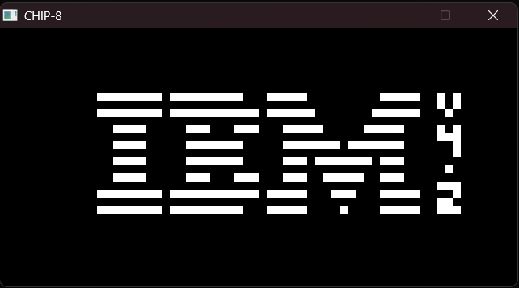
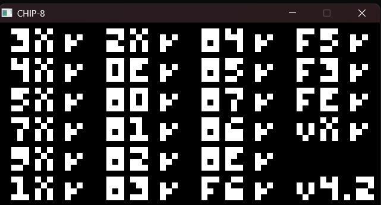
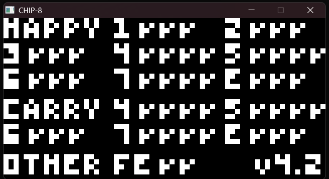
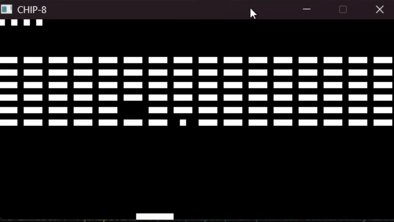
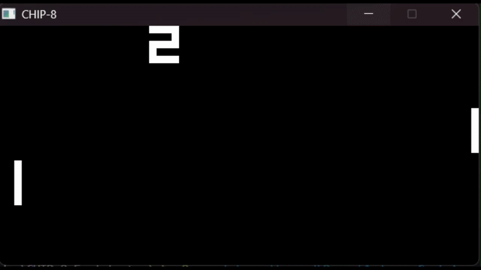
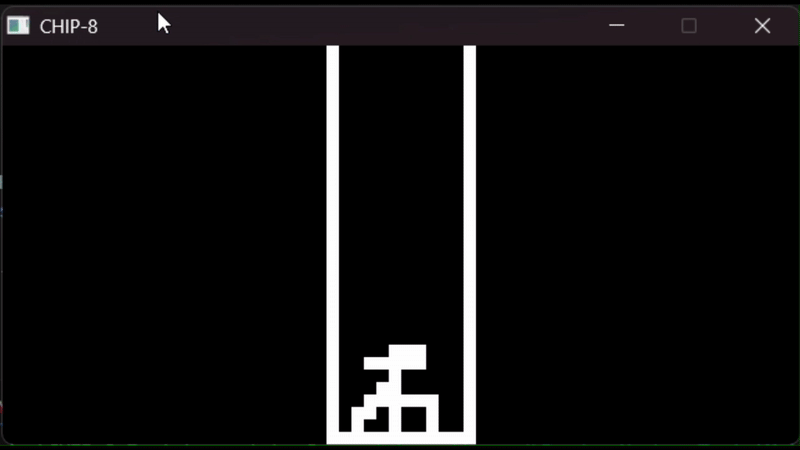
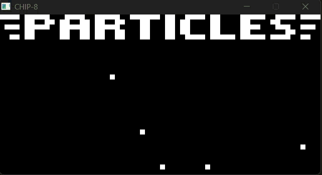
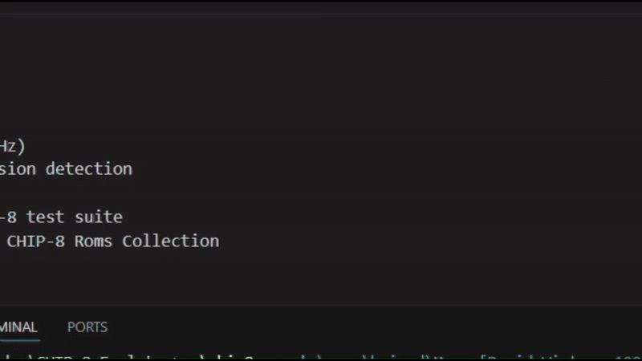

# CHIP-8 Emulator (C++ / SDL3)

A classic CHIP-8 emulator written in C++ using SDL3 for graphics and input.

This project was built to understand how emulators work internally, including
CPU execution, memory, timers, input handling, and graphics rendering.

---

## Features

- Full Classic CHIP-8 instruction set (no SCHIP / XO-CHIP)
- 64×32 monochrome display
- Keyboard input mapping
- Delay and sound timers (60 Hz)
- Sprite rendering with XOR drawing and collision flag (VF)
- Basic sound (beep)
- Tested using Timendus' CHIP-8 test suite
- Tested with games from Kripod’s CHIP-8 ROM collection

---

## How to Build

### Requirements
- C++ compiler (g++)
- SDL3

### Build Command (Windows)

```bash
g++ main.cpp chip8.cpp -o chip8.exe ^
  -I C:/Libraries/SDL3/x86_64-w64-mingw32/include ^
  -L C:/Libraries/SDL3/x86_64-w64-mingw32/lib ^
  -lSDL3
```
Replace the include and lib flags with your Library folders.

### Run

```bash
./chip8.exe <path_to_rom.ch8>
```

## Control Mapping
```
1 2 3 C -> 1 2 3 4
4 5 6 D -> Q W E R
7 8 9 E -> A S D F
A 0 B F -> Z X C V
```

## Screenshots/GIFs

### Timendus Test Suite




### Kripod Game Collection






## Quirks

This emulator targets **classic CHIP-8 behavior** with the following choices:

- Shift instructions (8XY6 / 8XYE) use **VY** as the source
- FX55 / FX65 increment the index register (I)
- Sprite drawing uses **screen wrapping** instead of clipping

These behaviors are intentional and documented.

## Author
Built by Abhinav Prakash
Year: 2025

## Credits

[Timendus Test Suite for CHIP-8](https://github.com/Timendus/chip8-test-suite/)  
Original GPL license is included in `roms/Timendus/LICENSES`.

[Kripod CHIP-8 ROMs](https://github.com/kripod/chip8-roms/)  
Original license is included in `roms/kripod/LICENSES`.